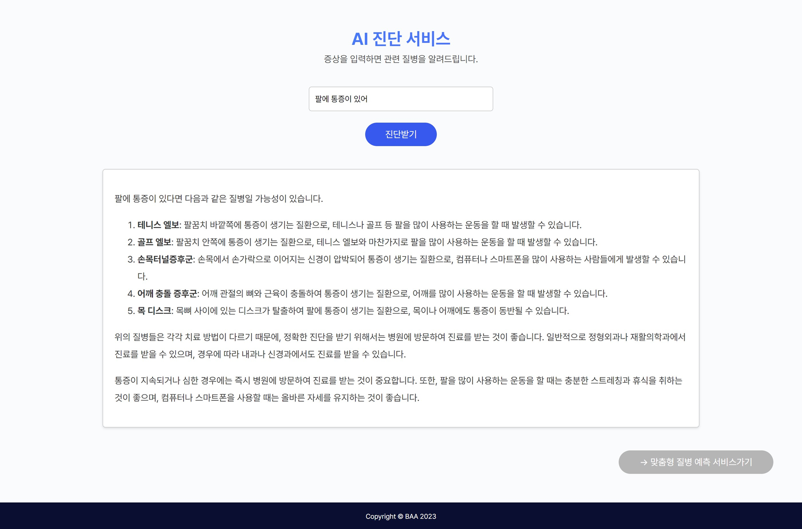
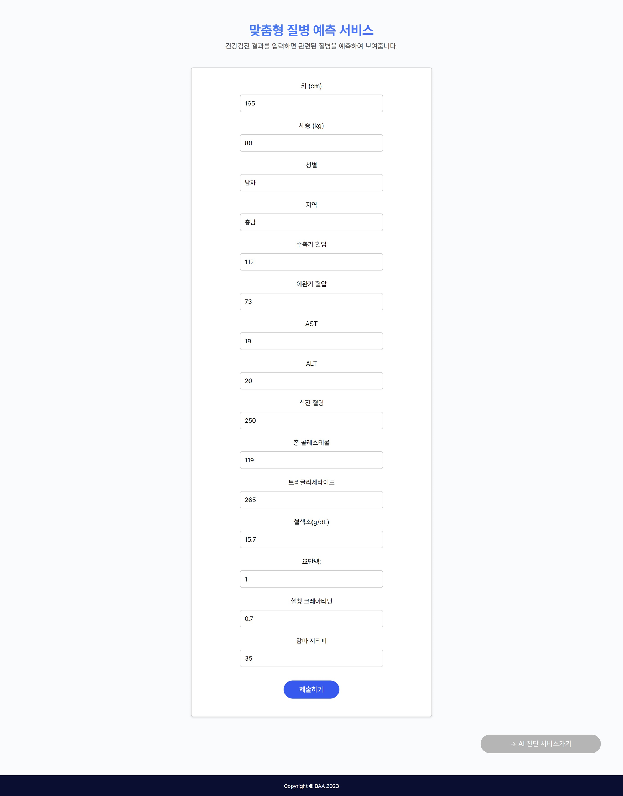
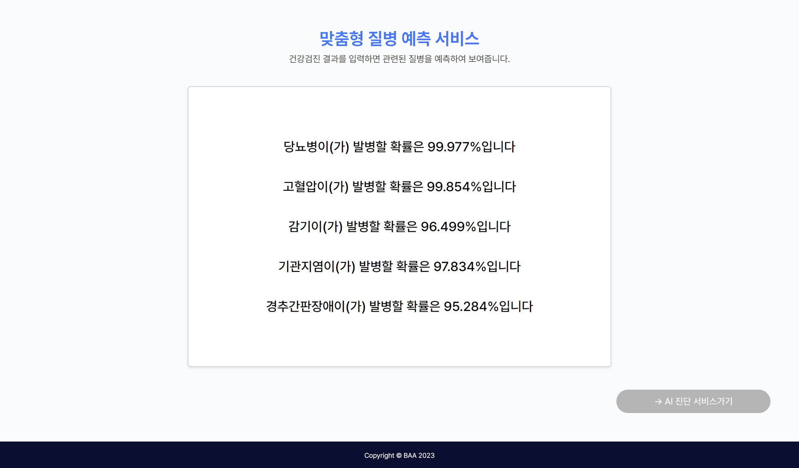

# BDIA_Hackathon

# 1. 팀 구성
---
강민지
김소연
박시윤
최예진

# 2. 서비스 개요

---

> **서비스명**
> 

Clova Studio를 활용한 AI 기반 스마트 닥터 서비스

> **한줄 소개**
> 

스마트 닥터 서비스는 맞춤형 건강 정보와 진단 서비스를 제공한다.

> **개발 동기**
> 

2022년 11월 17일 발행된 ‘청년의사’ 기사는 “네이버 지식in 건강 관련 질문 답변 중, 비전문가가 작성한 답변 비율이 43%에 달하며, 특히 작성된 답변의 50% 이상은 특별한 근거가 없는 것으로 나타났다.” 고 밝혔다.

대대수의 사람들이 건강 이상 증상이 발견되면 검색 엔진을 통해 증상, 질병 정보를 얻으려 하지만 근거 없는 의학 정보 및 과잉 진료 정보나 건강 기능 식품 광고를 접하는 경우가 많다.

이러한 문제점을 해결하고자 AI 닥터에 의학 정보를 학습시키고 사용자에게 전문적인 질병 정보를 제공한다. 그리고 사용자의 개별 특성을 고려하여 질병 예측 정보 및 증상 관련 질병 정보를 제공하여 사람들이 보다 정확한 의학 및 질병 정보를 얻을 수 있게 한다.

# 3. 세부 내용

**사용기술, 구현방안 등 작품에 대한 자세한 사항을 자유롭게 알려주세요.**

---

1. AI 의료정보 제공 챗봇 : 이상 증상을 겪고 있는 회원은 챗봇과의 대화를 통해 자신의 증상을 설명하면, 관련된 질병에 대한 올바른 정보와 진료 병원을 제공받아 빠르게 조치를 취할 수 있다.
2. 개인 맞춤형 건강 관리 : 사용자 건강 데이터를 기반으로 발생 가능성이 높은 질병을 예측한다. 이를 통해 개인 건강상태에 따른 맞춤형 건강관리 지원하고 사용자는 자신의 건강 상태를 더 잘 이해할 수 있다.

- **사용 기술 :**

python, jupyter notebook, django, xgboost, randomforest, adaboost

- **구현 내용 :**
1. 챗봇 : 자신의 증상을 입력함으로써, 신뢰할 만한 자료를 토대로 현재 증상과 관련된 질병들에 대한 예상 증상과 원인, 그리고 상세한 설명을 얻을 수 있도록 Naver Clova의 언어 인공지능을 활용했습니다. 이를 통해 사용자가 원하는 정보에 대한 상세한 답변을 제공합니다. 더불어, 질병 증상에 관한 언어 데이터를 학습시켜 만들어진 인공지능의 API를 웹 환경에 적용함으로써, 개발 과정을 효율적으로 단축할 수 있었습니다.
2. 건강관리 : 사용자의 건강검진 데이터를 활용하여 취약 질병을 예측하는 분류 모델을 구현했습니다. 이 모델은 가장 흔한 5가지 질병에 걸릴 확률을 결과값으로 제시합니다. XGBoost, RandomForest, AdaBoost 세 가지 모델을 사용해 실험한 결과, XGBoost 모델의 정확도가 가장 높아 최종 모델로 선택했습니다. 또한, 사용자가 입력한 값으로 즉시 예측을 수행하고 비동기 방식으로 화면 내에서 예측 값을 확인할 수 있도록 폼에 반응형 기능을 구현했습니다.

# 4. 기대 효과

**서비스를 통해 얻을 수 이점, 발전 방향성 등을 알려주세요.**

---

1. **AI 의료정보 제공 챗봇**
    - 빠른 응급 대처 : 이상 증상을 겪는 사용자는 빠르게 챗봇을 통해 증상을 설명하고, 즉각적으로 관련된 질병 정보와 진료 병원 정보를 얻을 수 있다. 이로써 응급 상황에서 빠른 조치를 취할 수 있어 생명을 보호하는 데 도움이 될 것이다.
    - 정보 접근성 향상 : 사용자는 언제든지 챗봇을 통해 의료 정보에 접근할 수 있으므로, 건강 관리에 대한 궁금증이나 우려사항을 빠르게 해결할 수 있다.
2. **개인 맞춤형 건강 관리**
    - 예방적 건강 관리 : 사용자 건강 데이터를 기반으로 AI는 발생 가능성이 높은 질병을 사전에 예측한다. 이를 통해 사용자는 예방 조치를 취하고 건강 상태를 개선하는데 도움을 받을 수 있다.
    - 자가 건강 이해 촉진 : 예측된 질병 및 건강 추천 사항은 사용자에게 자신의 건강 상태를 더 잘 이해하게 도와준다. 이를 통해 사용자는 더 적극적으로 건강에 대한 책임을 지게 되어 건강한 라이프스타일을 채택할 가능성이 높아진다.
    - 비용 절감 및 효율성 향상 : 예방적인 접근은 질병 예방을 통해 의료 비용을 감소시키고, 개인 맞춤형 건강 서비스는 효율적인 의료 관리를 가능하게 한다.

AI 닥터 서비스는 사용자에게 개인 맞춤형 건강 서비스를 제공하여 건강한 삶을 살 수 있도록 돕고, 응급 상황에서의 신속한 대응을 통해 생명을 보호하는 데 기여할 것으로 기대된다. 또한, 예방적인 접근은 전반적인 의료 비용을 감소시키고, 개인의 건강 상태를 개선하여 삶의 질을 향상시킬 수 있다.

# 5. 스크린샷

